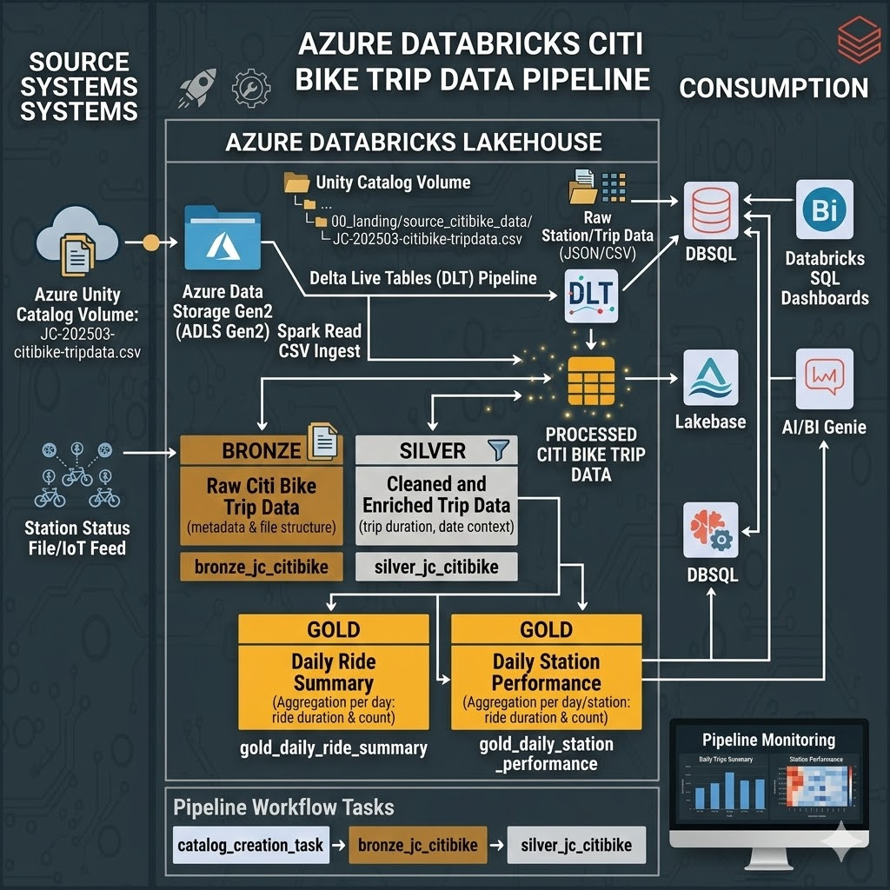
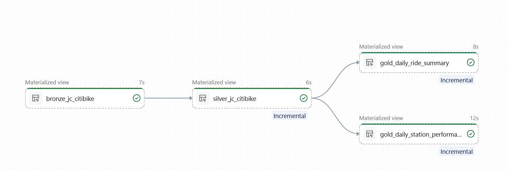

# databricks_citbike_CI-CD project

**A Databricks project for Citibike ETL pipelines and utilities.**  
Includes reusable Python modules, Databricks job/pipeline configs, and notebooks for bronze/silver/gold ETL layers.

> 🔧 Quick summary: Source code lives in `src/`; Databricks job/pipeline configs in `resources/`; unit tests in `tests/`.

### Badges
- Build: ``
- Coverage: ``

(Replace `<OWNER>/<REPO>` with the GitHub owner and repo name to enable badges.)

---

## Features
- Databricks-ready project scaffolding with job/pipeline definitions
- Notebooks + Python scripts for ETL: bronze → silver → gold
- Unit tests and fixtures for local testing
- CI configured via `.github/workflows/ci-workflow.yml`

---

## Repository layout
- `src/` — Python package code (`citibike`, `dab_project`, `utils`)
- `resources/` — Databricks job and pipeline YAMLs
- `citibike_etl/` — notebooks and pipeline notebooks
- `tests/` — unit tests and fixtures
- `scripts/` — helper scripts and runbooks

---

## Python packages & utilities 📦

The project exposes a small set of reusable helpers that are used by the ETL
notebooks and can also be imported in external code.  The two primary
packages are:

### `citibike.citibike_utils`
Provides functions for transforming Citibike trip data using PySpark.  For
example:

```python
from citibike.citibike_utils import get_trip_duration_mins

# spark is a `SparkSession` or `DatabricksSession`
df = spark.read.parquet("/path/to/raw/trips")
df2 = get_trip_duration_mins(
    spark,
    df,
    start_col="start_ts",
    end_col="end_ts",
    output_col="duration_min",
)
```

### `utils.datetime_utils`
Utility helpers for working with date/time columns:

```python
from utils.datetime_utils import timestamp_to_date_col

df3 = timestamp_to_date_col(
    spark,
    df2,
    timestamp_col="start_ts",
    output_col="ride_date",
)
```

Additional modules live under `src/` and can be extended as needed.  The
`dab_project.main` entrypoint is currently a noop but is provided for
packaging.

---

## Testing with Spark 🧪

Unit tests are located in `tests/` and make use of a pytest fixture defined
in `tests/conftest.py`.  The fixture attempts to create a Spark session
using **Databricks Connect** (`DatabricksSession`) and falls back to a local
`pyspark.sql.SparkSession` if the former isn't available.  This allows the
same tests to run both locally and against a remote Databricks cluster.

```python
# example from tests/test_citibike_utils.py

def test_get_trip_duration_mins(spark):
    data = [
        (datetime.datetime(2025, 4, 10, 10, 0, 0), datetime.datetime(2025, 4, 10, 10, 10, 0)),
        (datetime.datetime(2025, 4, 10, 10, 0, 0), datetime.datetime(2025, 4, 10, 10, 30, 0))
    ]
    schema = "start_timestamp timestamp, end_timestamp timestamp"
    df = spark.createDataFrame(data, schema=schema)
    result_df = get_trip_duration_mins(
        spark, df, "start_timestamp", "end_timestamp", "trip_duration_mins"
    )
    assert result_df.collect()[0][0] == 10
```

To run the tests you only need to have either `databricks-connect` or
`pyspark` installed in your development environment (see requirements
sections).  The project ships with `pytest` configuration in
`pytest.ini` and coverage support via `pytest-cov`.


---

## Requirements & setup ⚙️
- Python 3.8+ recommended
- Optionally use a virtual environment:
  ```bash
  python -m venv .venv
  .venv\Scripts\activate   # Windows
  ```
- Install dependencies:
  - Using uv (project recommended in original template):
    ```bash
    uv sync --dev
    ```
  - Or with pip (alternative):
    ```bash
    pip install -e .
    pip install -r requirements-pyspark.txt
    pip install -r requirements-dbc.txt
    ```

---

## Development & testing 🧪
- Run unit tests:
  ```bash
  uv run pytest
  # or
  pytest -q
  ```
- Generate coverage (example with pytest-cov):
  ```bash
  pytest --cov=src tests/
  ```

---

## Architecture 📐

The following diagrams outline the overall project structure and pipeline flow:





## Running locally / Databricks CLI
- Authenticate to Databricks:
  ```bash
  databricks configure
  ```
- Deploy bundle to `dev`:
  ```bash
  databricks bundle deploy --target dev
  ```
- Deploy to `prod`:
  ```bash
  databricks bundle deploy --target prod
  ```
- Run a job/pipeline:
  ```bash
  databricks bundle run
  ```
